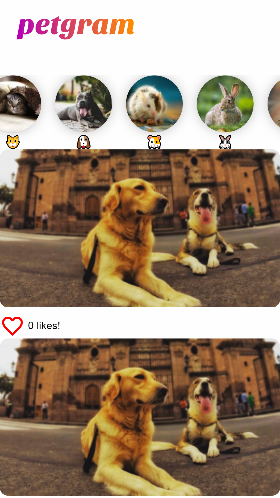

# App de fotos similar a Instagram ⚛️

App de fotos integrada con la API propia

## ¿Cómo funciona?

Require Node.JS 10

- `npm install` para instalar las dependencias
- `npm run dev` para el entorno de desarrollo
- `npm run build && npm start` para el entorno de producción.

## Licencia

MIT
